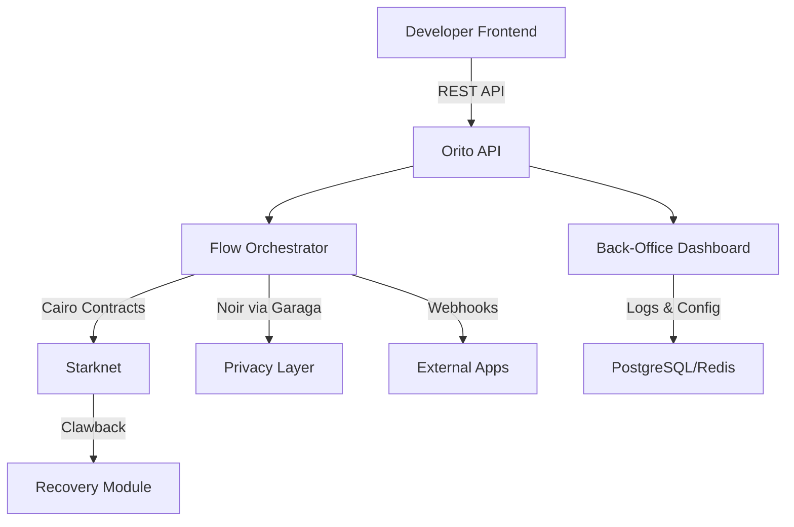

# 🌟 Orito: Revolutionizing Bitcoin Asset Management on Starknet

Welcome to **Orito**—the ultimate platform for seamless Bitcoin asset management on the Starknet blockchain! Built with **Cairo** and enhanced by **Noir** (via Garaga) for top-tier security, Orito empowers developers, startups, and organizations to handle Bitcoin assets with ease, speed, and bulletproof privacy. Say goodbye to complex smart contracts and hello to a sleek, no-code/low-code experience inspired by the elegance of Stripe Connect.

**Orito** (from Spanish "gold") reflects the value of Bitcoin and the golden simplicity of our platform. Ready to dive in? Let’s explore!

---

## 🚀 Why Orito?

Orito is your gateway to managing Bitcoin assets on Starknet without the headaches of traditional blockchain integration. Here’s why it shines:

- **No Smart Contract Hassle**: Use our audited Cairo templates and skip writing custom contracts.
- **Privacy First**: Noir (via Garaga) ensures secure, private transactions with zero-knowledge proofs.
- **Developer-Friendly**: Robust APIs, SDKs, and a slick back-office for non-technical users.
- **Scalable & Secure**: Built for startups, enterprises, and nonprofits with clawback and auditability.
- **Bitcoin on Starknet**: Leverage Starknet’s Layer-2 scalability for fast, low-cost Bitcoin transactions.

---

## 🎯 Who’s It For?

| Audience                     | Why They’ll Love Orito                                                                 |
|-----------------------------|--------------------------------------------------------------------------------------|
| **Web2/Web3 Developers**    | Integrate Bitcoin payments without diving into smart contract complexity.            |
| **Startups & Entrepreneurs**| Automate asset collection and distribution with minimal setup.                       |
| **Nonprofits**              | Distribute emergency funds securely with clawback for error recovery.                |
| **B2B Platforms**           | Scale internal asset flows without rebuilding infrastructure.                        |

---

## 🛠️ Core Features

### 1. **Powerful REST API**
- Create and manage Bitcoin asset flows effortlessly.
- Webhooks for real-time updates.
- Error handling and retry logic baked in.

### 2. **Flow Orchestrator**
- Validates and executes transactions on Starknet.
- Supports rules for timing, recipients, and splits.
- Clawback functionality for error correction.

### 3. **Back-Office Dashboard**
- Configure one-time, scheduled, or bulk Bitcoin transfers.
- Visualize audit logs and track errors.
- Import CSV/JSON for mass payouts.

### 4. **Emergency Aid Module**
- Rapid Bitcoin distribution for humanitarian aid.
- Transparency and compliance controls.
- Clawback for secure fund recovery.

---

## 🏗️ Project Structure

```plaintext
orito/
├── apps/
│   ├── services/     # API and orchestrator logic (Cairo, TypeScript)
│   ├── landing/      # Back-office UI (React)
│   └── contracts/    # Cairo contracts + Noir privacy layer (via Garaga)
├── docs/             # Guides and examples
└── tests/            # Unit and integration tests
```

---

## ⚙️ Technical Stack

| Component           | Tech Stack                              |
|--------------------|-----------------------------------------|
| **Blockchain**     | Starknet (Layer-2 on Ethereum)         |
| **Contracts**      | Cairo (audited templates)              |
| **Privacy**        | Noir via Garaga (zero-knowledge proofs)|
| **Database**       | PostgreSQL + Redis                     |
| **Backend**        | Cairo, TypeScript                      |
| **Frontend**       | React (back-office)                    |
| **Infrastructure** | Docker, Kubernetes (for scaling)       |

**Security Highlights**:
- 🔒 Digitally signed logs for auditability.
- 🛡️ Third-party audited Cairo contracts.
- 🔄 Clawback support for secure recovery.
- ✅ Comprehensive unit and integration tests.

---

## 🧑‍💻 Developer Goodies

- **SDKs**: JavaScript, Python, Cairo.
- **Docs**: Rich guides with plug-and-play examples.
- **CLI Tools**: Automate tasks from your terminal.
- **Simulator**: Test integrations in a sandbox environment.



---

## 🛤️ Roadmap

| Phase          | Milestones                                  |
|----------------|---------------------------------------------|
| **MVP**        | Single asset flows, API, basic back-office  |
| **Public Beta**| Bulk transfers, clawback, developer docs   |
| **Production** | Multilingual support, third-party integrations, Latam/Africa validation |

---

## 💸 Business Model

- **Transaction Fees**: Pay a small percentage per Bitcoin transfer.
- **Subscription Plans**: Unlock advanced features and lower fees.
- **Enterprise Tier**: Custom solutions for high-volume clients.

---

## 🌍 Join the Orito Community

- **Website**: [Coming Soon]
- **GitHub**: [Coming Soon]
- **Support**: Discord/Matrix [Coming Soon]

Orito isn’t just a platform—it’s a movement to make Bitcoin asset management accessible, secure, and scalable. Whether you’re a developer, startup, or nonprofit, Orito empowers you to build the future of finance on Starknet.

---

*Let’s make Bitcoin management **golden** with Orito!*
